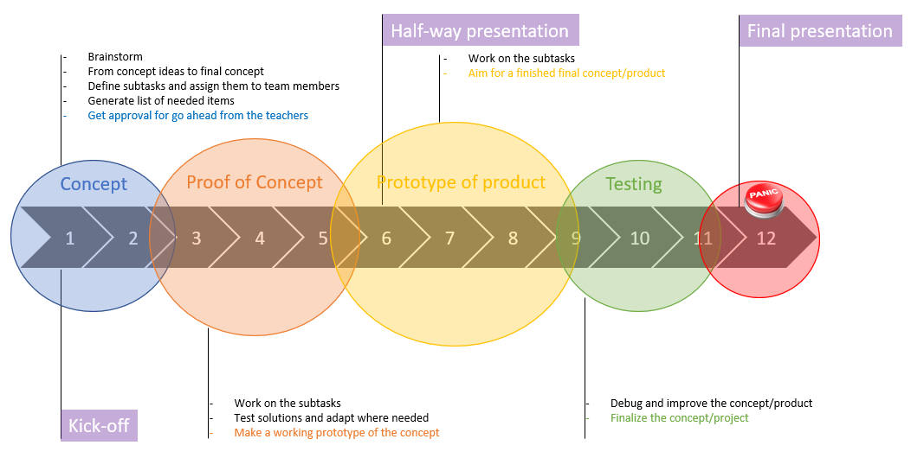
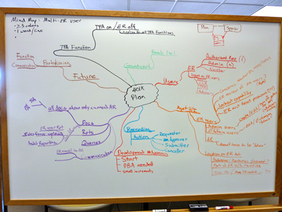

# Project workflow

To insure a good progress of the project the teams will follow this workflow.

## Concept

We start project experience with a **kick-off moment** where students choose one of the presented projects and by doing so teams are formed.

1. Gather information
    * Get as much input from the product owner (a teacher) as possible.
    * Search the internet for relevant topics to gather more information.

2. Brainstorm

    
    * Mind maps allow the team to explore ideas and the connection between these ideas. The information gathered is used to do so.
    * The team generates a few concept ideas.

3. Working towards one concept
    * weigh the pros and cons of each idea and by using parts of multiple ideas form one concept idea.
    * define subtasks to generate a proof of concept.
    * generate a list of needed items.
    * make a estimation of the cost for the project.

4. Get approval for a go ahead
    * present your concept to the product owner for approval.
    * make adjustments if needed.

**📝 Administration**

1. Redmine

    * create tasks and assign them to team members.
    * each team member registers his/her hours worked on a task ( once a day ).
    * when progress is made in a task then that also is set.

    ::: warning 📢Attention
    Redmine is the only tool teachers will consult to view the progress of each team and the performed work of each team member.
    :::

2. GitHub

    Create new repository for the project and start writing the `README.md`.

::: tip ⏰ Deadline

By the end of week 2 each team should have the approval for go ahead from the product owner.

:::

## Proof of Concept

Now that you have the go ahead from the product owner you start working towards a proof of concept.
Seperate parts of the concept need to be developed and tested. Information flow needs to be defined.

1. Breake down the concept in seperate parts.
    * define seperate parts that need to be developed an tested.
    * make sure the connection between these parts doesn't get lost.
    * use the scrum technique to get all the work done.

2. Make a orderlist for parts
    Always make sure you give the following information to the product owner:
    * Name and contact information of the supplier.
    * VAT number of the supplier.
    * the list of parts (part number , part description, price and amount)

    If the parts need to be ordered in a online shop then you can make a screenshot of the shoppingcart.
    If the parts need to be ordered by mail, then a quotation is needed.

    We expect the teams to provide in small (low cost) parts them selfs.
    The amount a team spends on the project should be equaly payed for by each team member and should not exceed 10€/student.

The main goal is proving the concept will work.

**📝 Administration**

Keep updating Redmine and add all files to the project repository.
All files that the team generates, if it's a piece of software, a datasheet, 3D print files, ... need to be added to the repository.

::: tip ⏰ Deadline

By the end of week 4 each team should have ordered the needed parts at the product owner.
By the end of week 5 each team should have a working prototype of the concept.

:::

### Half-way presentation

During week 6 each team will present there project to the teachers.
The presentation must contain:
* The problem statement 
* The concept
* The current status of the project
* The planning for the second half

## Prototype of product

Now that you have proof of concept and presented that concept to the teachers you can work towards a prototype of your product.

Use the feedback you got from the teachers and start planning all tasks to make the prototype.
Don't forget to ask the product owner for delivery times on ordered parts.

**📝 Administration**

Keep updating Redmine and add all files to the project repository.

::: tip ⏰ Deadline

By the end of week 9 each team should have a working prototype of the product.

:::

## Testing & documentation

Now that there is a working prototype of the product, the teams will start extended tests to locate possible issue's.
Any issue's found should be addressed to.

A thorough documentation should be written so other students or teachers can continue work on the project.

**📝 Administration**

Keep updating Redmine and add all files to the project repository.

::: tip ⏰ Deadline

By the end of week 11 each team should have a debugged prototype of the product that has been fully documented.

:::

### Final presentation

During week 12 each team will present there project to the teachers.
The presentation must contain:
* The problem statement 
* The proof of concept
* The prototype of product
* The planning
* The role of each team member
* Some final thoughts on the project

🎥 Also each team must make a short film of the project for promotional purposes.

