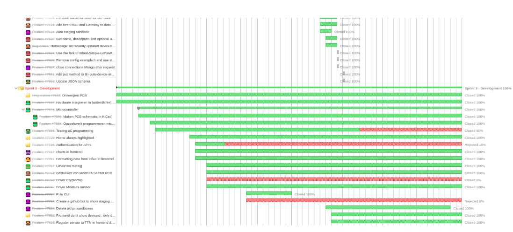

# Project workflow

To insure a good progress of the project the teams will follow this workflow.

**Important deadlines**

* week 2: Approval for a go ahead from the teachers
* week 5: A working prototype of the concept
* week 6: Half-way presentation
* week 9: Finished product, ready for debugging
* week 11: Finalized product
* week 12: Final presentation

## Scrum technique

Agile Scrum is an iterative software development methodology specifically designed to build products faster. Agile Scrum uses short pre-defined development cycles (called sprints or cycles), with each cycle resulting in potentially shippable functionality delivered.

Each project will have a **product owner**, a teacher, that is the team's client. The product owner is the team's **first point of contact** during project experience.

The team appoints a **scrum master** that schedules weekly **scrum meetings**.
Tasks or **sprints** are defined with **timeschedules** which are **assigned to teammembers**.

## Redmine

To keep track of the project, its tasks and the workload of each team member we use the tool [Redmine](https://project.devbit.be/).

In Redmine all sprints must be entered with all there subtasks. Tasks must be assigned to team members. Each team member must register there work at the end of each day for each task they worked on. The progress of the tasks must be adjusted accordingly.

::: warning 📢Attention
Redmine is the only tool teachers will consult to view the progress of each team and the performed work of each team member.
:::

## GitHub

A project has a [GitHub repository](https://github.com/vives-project-xp) where all files (source code, 3D print files, images, ...) will be pushed. This means that all tests, failing tries as well as the final versions will be pushed to GitHub. 

Each repository has a `README.md` that documents the project very well:
* What your project does
* How to install it
* Example usage
* Screenshots
* How to set up the dev environment
* License and author info

