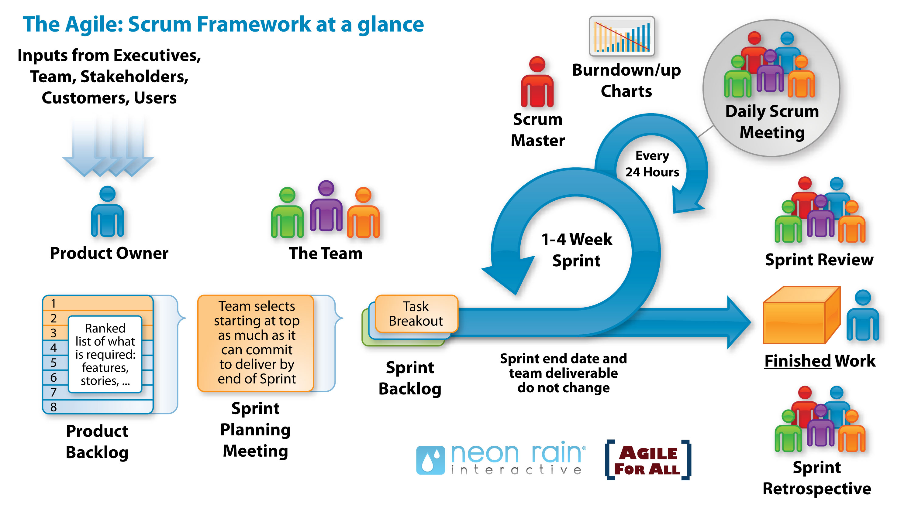

# Scrum technique

Agile Scrum is an iterative software development methodology specifically designed to build products faster. Agile Scrum uses short pre-defined development cycles (called sprints or cycles), with each cycle resulting in potentially shippable functionality delivered.

Each project will have a **product owner**, a teacher, that is the team's client. The product owner is the team's **first point of contact** during project experience.

The team appoints a **scrum master** that schedules weekly **scrum meetings**.
Tasks or **sprints** are defined with **timeschedules** which are **assigned to teammembers**.
